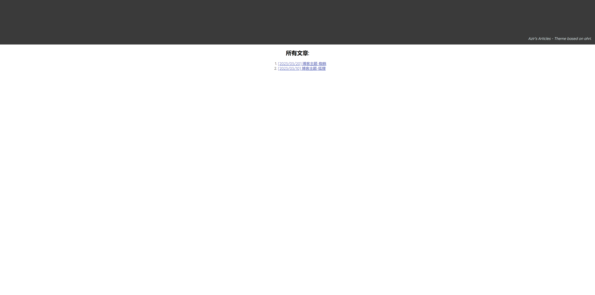

# ahri

ahri. copied from [https://tech-zh.netlify.app](https://tech-zh.netlify.app)

## Preview




## Configuration

```json
{
  "title": "Azir's Articles",
  "theme": "ahri",
  "disableKinds": [
    "taxonomy",
    "term",
    "sitemap",
    "section",
    "RSS",
    "404"
  ],
  "uglyurls": true,
  "permalinks": {
    "/": "/:filename"
  },
  "menu": {
	  "elise": [
		  {
			  "name": "Github",
			  "url": "https://github.com/ipv4sec"
		  },
		  {
			  "name": "Email",
			  "url": "mailto:ipv4sec[AT]gmail[DOT]com"
		  }
	  ]
  }
}
```

## Copyright
Licensed under the MIT license. Check the LICENSE file for details.